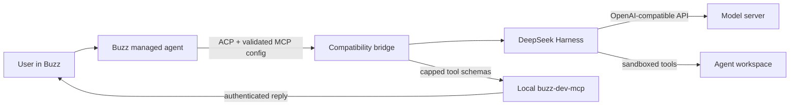

# Buzz DeepSeek Harness

[](https://github.com/Bostonvex/buzz-deepseek-harness/actions/workflows/ci.yml)
[](LICENSE)
[](https://nodejs.org/)

Run [DeepSeek Harness](https://github.com/deepseek-ai/deepseek-harness) as a
custom ACP harness in [Buzz](https://buzz.xyz/) and connect it to any suitable
OpenAI-compatible model endpoint.

DeepSeek Harness is the agent runtime in this project; the served model does
not have to be a DeepSeek-branded model.

The model can run on the same machine as Buzz, another workstation, a GPU
server, a multi-node inference cluster, a container platform, or a hosted API.
The bridge does not manage accelerators, model loading, sharding, or cluster
scheduling; it only needs a network-reachable OpenAI-compatible API.

When Buzz telemetry is enabled, the ACP compatibility layer observes live
`tool_call` and `tool_call_update` notifications. Terminal turns therefore
report an exact observed tool count, including a meaningful zero; telemetry
remains metadata-only and fail-open.

> [!IMPORTANT]
> The repository defaults describe the deployment it was originally built for:
> model id `ds-0731`, a 1,048,576-token context window, and 16,384 maximum output
> tokens. Override these values with the capabilities of your own model server.
> Advertising limits that the server cannot actually support will cause failed
> or truncated turns.

## Contents

- [What this project fixes](#what-this-project-fixes)
- [Architecture](#architecture)
- [Compatibility](#compatibility)
- [Quick start](#quick-start)
- [Authenticated endpoints](#authenticated-endpoints)
- [Non-default Buzz locations](#non-default-buzz-locations)
- [Configuration reference](#configuration-reference)
- [Updating or changing models](#updating-or-changing-models)
- [Troubleshooting](#troubleshooting)
- [Security and trust model](#security-and-trust-model)
- [Uninstall](#uninstall)
- [Development](#development)
- [Related harnesses](#related-harnesses)
- [License](#license)

## What this project fixes

DeepSeek Harness 0.1.1-rc.2 and Buzz do not connect cleanly without an adapter:

- DeepSeek Harness rejects ACP `session/new` requests that contain Buzz's
  client-supplied `mcpServers` configuration.
- Removing that MCP configuration makes model output invisible in Buzz because
  the agent loses the authenticated `buzz-dev-mcp` reply tools.
- Large MCP tool-schema `maxLength` values can make llama.cpp-derived grammar
  generators fail with `Failed to initialize samplers: failed to parse grammar`.
- DeepSeek Harness scrubs credential-shaped environment variables from Bash,
  including the Buzz seat and configured GitHub credentials required by the
  authenticated `buzz` and `gh` workflows.

This bridge validates and mounts exactly Buzz's local MCP sidecar, removes the
unsupported MCP array before forwarding `session/new`, caps model-facing schema
string lengths at 2,000, and restores only a small, explicit shell environment
allowlist needed by Bash-based Buzz and GitHub commands. Provider API keys,
1Password credentials, and unrelated credentials remain scrubbed from the
built-in Bash environment.

## Architecture



Buzz, this bridge, DeepSeek Harness, and `buzz-dev-mcp` run on the **Buzz
client host**. Only the model API belongs on the inference host or cluster.

| Model deployment | Typical API address from the Buzz host | Bridge changes |
|---|---|---|
| Same computer | `http://127.0.0.1:8000/v1` | None |
| LAN workstation or server | `http://model-host:8000/v1` | Use its DNS name or IP |
| Multi-node cluster | `http://cluster-head:8000/v1` | Point at the router/head endpoint; the cluster owns sharding |
| Container or VM | `http://host-or-service:8000/v1` | Publish the port and use an address reachable from Buzz |
| Hosted API or remote gateway | `https://api.example.com/v1` | Provide an inherited API-key variable and use TLS |

The CPU/GPU vendor, accelerator count, operating system, and inference engine
behind that address are not visible to the bridge.

[`examples/twinspark.env`](examples/twinspark.env) is the original deployment's
worked example, not a requirement. Replace every value rather than sourcing it
unchanged on unrelated hardware.

## Compatibility

### Buzz client host

- Buzz installed and able to run custom harnesses
- Node.js 22 or newer
- npm
- A POSIX `/bin/sh` environment for the two launcher scripts

macOS is the tested client platform. Linux can use the installer by supplying
the actual Buzz MCP executable and, when necessary, the Buzz data directory.
The installer knows conventional Linux and Windows data-directory locations,
but the current launchers are POSIX shell scripts, so native Windows execution
is not yet verified. This client-host limitation does **not** restrict the
hardware or operating system serving the model.

### Model endpoint

The endpoint must provide:

- an API root that includes `/v1`;
- `GET /models` using the common OpenAI response shape;
- streaming OpenAI Chat Completions behavior;
- a served model id that exactly matches `--model-id`;
- tool/function calling compatible with the model's chat template;
- support for `max_tokens` and a system prompt sent without the `developer`
  role.

Common choices include llama.cpp-compatible servers, vLLM, SGLang, Ollama,
LM Studio, TensorRT-LLM gateways, and hosted OpenAI-compatible services. Their
hardware support and launch flags differ; configure the server using its own
documentation, then give this bridge only its API URL, model id, limits, and
credential reference.

Tool use is the most important compatibility test. An endpoint can successfully
answer a plain chat request while still using a chat template that cannot emit
valid tool calls. Prefer a coding/instruct model and server template explicitly
designed for tool calling.

## Quick start

### 1. Verify the model endpoint from the Buzz host

Use values for your deployment:

```sh
MODEL_BASE_URL="http://model-host:8000/v1"
MODEL_ID="your-served-model-id"

curl -fsS \
  -H "Authorization: Bearer local" \
  "${MODEL_BASE_URL}/models"
```

For an authenticated service, replace the non-secret `local` placeholder with
a real credential supplied securely by your environment. Confirm that the
response contains `MODEL_ID`. If this request fails from the Buzz host, the
bridge will fail too—fix DNS, routing, server bind address, firewall rules,
TLS, or authentication first.

For a server on another machine, do not leave it bound only to `127.0.0.1`.
Bind it to an appropriate private interface and restrict access with a firewall,
VPN, or authenticated reverse proxy. Avoid exposing an unauthenticated model
server directly to the public internet.

### 2. Install the bridge

```sh
git clone https://github.com/Bostonvex/buzz-deepseek-harness.git
cd buzz-deepseek-harness
npm ci --ignore-scripts
```

Choose honest capabilities for the loaded model:

```sh
MODEL_NAME="My coding model"
PROVIDER_NAME="Local model server"
MODEL_CONTEXT_TOKENS="131072"
MODEL_MAX_OUTPUT_TOKENS="8192"

npm run install:buzz -- \
  --base-url "${MODEL_BASE_URL}" \
  --model-id "${MODEL_ID}" \
  --model-name "${MODEL_NAME}" \
  --provider-name "${PROVIDER_NAME}" \
  --context-window "${MODEL_CONTEXT_TOKENS}" \
  --max-tokens "${MODEL_MAX_OUTPUT_TOKENS}" \
  --unauthenticated
```

`--unauthenticated` writes the non-secret placeholder value `local`. It is for
servers that do not validate bearer tokens. It does not disable the OpenAI
client library's expectation that a credential value exists.

The installer:

1. validates Node, the launcher, dependencies, and the Buzz MCP executable;
2. creates a timestamped backup of any existing `deepseek-harness.json`;
3. writes a non-secret custom-harness manifest; and
4. stores absolute paths to this checkout and its Node executable.

Keep the checkout at the same path after installation. Moving or deleting it
breaks the manifest's command path; rerun the installer after any move.

### 3. Verify the installation

```sh
npm run doctor
```

`doctor` checks:

- Node.js and locked dependencies;
- the trusted Buzz MCP executable;
- the installed custom-harness manifest;
- all model-facing schema limits;
- the endpoint's `/models` response; and
- an ACP initialize plus `session/new` handshake.

For offline inspection only:

```sh
npm run doctor -- --skip-endpoint
```

`--skip-acp` also skips the ACP handshake, but should not be used as proof that
the harness is ready.

### 4. Select the harness in Buzz

Harness installation and agent configuration are two different layers:

1. The installer above registers the harness once for Buzz.
2. In the **individual agent's** create/edit screen, select
   **DeepSeek Harness (OpenAI-compatible)** and its advertised model.
3. Stop and start that individual managed agent so its ACP worker pool loads
   the new manifest. Restart Buzz itself only if the harness picker has not
   refreshed.

Start with a no-tool test:

```text
Diagnostic only. Do not use tools. Reply exactly: DeepSeek Harness connected.
```

Then test coding tools in a disposable workspace:

```text
Create hello.py that prints "ACP coding tools work", run it, verify the output,
and tell me exactly which file you changed.
```

The first test proves model output reaches the Buzz chat. The second proves the
model, chat template, harness tools, workspace policy, and reply MCP work
together.

## Authenticated endpoints

Do not place API-key values in this repository, the custom-harness JSON, command
arguments, issues, or logs. Install with the **name** of an environment variable:

```sh
npm run install:buzz -- \
  --base-url "https://api.example.com/v1" \
  --model-id "${MODEL_ID}" \
  --model-name "${MODEL_NAME}" \
  --provider-name "Remote model API" \
  --context-window "${MODEL_CONTEXT_TOKENS}" \
  --max-tokens "${MODEL_MAX_OUTPUT_TOKENS}" \
  --api-key-env MODEL_SERVER_API_KEY
```

Provision `MODEL_SERVER_API_KEY` in the environment inherited by the **Buzz
application process**, not only in an unrelated terminal. How to do that
depends on how Buzz is launched: a shell, desktop session, service manager, or
device-management system. Run `doctor` from an environment carrying the same
variable, then restart the individual agent.

The key authenticates model requests but remains scrubbed from DeepSeek
Harness's built-in Bash commands.

## Non-default Buzz locations

The tested macOS defaults are:

```text
Buzz data:  ~/Library/Application Support/xyz.block.buzz.app
Buzz MCP:   /Applications/Buzz.app/Contents/MacOS/buzz-dev-mcp
```

On Linux or a nonstandard installation, locate the real executable and data
directory, then pass absolute paths:

```sh
npm run install:buzz -- \
  --base-url "${MODEL_BASE_URL}" \
  --model-id "${MODEL_ID}" \
  --model-name "${MODEL_NAME}" \
  --provider-name "${PROVIDER_NAME}" \
  --context-window "${MODEL_CONTEXT_TOKENS}" \
  --max-tokens "${MODEL_MAX_OUTPUT_TOKENS}" \
  --mcp-command "/absolute/path/to/buzz-dev-mcp" \
  --buzz-data-dir "/absolute/path/to/xyz.block.buzz.app" \
  --unauthenticated
```

The Linux data-directory default is
`${XDG_DATA_HOME:-~/.local/share}/xyz.block.buzz.app`, but the MCP executable
has no portable default and should be supplied explicitly.

## Configuration reference

The installer writes non-secret settings into Buzz's
`custom_harnesses/deepseek-harness.json`.

| Installer option | Manifest environment variable | Meaning | Default |
|---|---|---|---|
| `--base-url` | `DSH_BASE_URL` | OpenAI-compatible API root, including `/v1` | `http://127.0.0.1:8000/v1` |
| `--model-id` | `DSH_MODEL_ID` | Exact id accepted by the API | `ds-0731` |
| `--model-name` | `DSH_MODEL_NAME` | Human-readable model label | `DeepSeek V4 Flash` |
| `--provider-name` | `DSH_PROVIDER_NAME` | Human-readable endpoint/provider label | `Twin DGX Spark` |
| `--context-window` | `DSH_CONTEXT_WINDOW` | Actual model context capacity | `1048576` |
| `--max-tokens` | `DSH_MAX_TOKENS` | Actual maximum generated tokens | `16384` |
| `--api-key-env` | `DSH_API_KEY_ENV` | Name—not value—of the inherited model credential | `DSH_LOCAL_API_KEY` |
| `--permission-mode` | `DSH_PERMISSION_MODE` | File policy: `read-only`, `workspace-write`, or `danger-full-access` | `workspace-write` |
| `--sessions-root` | `DSH_ACP_SESSIONS_ROOT` | DeepSeek Harness session persistence | `~/.dsh/acp-sessions` |
| `--node` | `DSH_NODE_BIN` | Absolute Node.js executable used by Buzz | current Node executable |
| `--mcp-command` | `DSH_TRUSTED_MCP_COMMAND` | Exact trusted `buzz-dev-mcp` executable | macOS Buzz app path |
| `--buzz-data-dir` | — | Buzz application-data directory containing `custom_harnesses` | platform convention |
| `--label` | — | Harness name shown by Buzz | `DeepSeek Harness (OpenAI-compatible)` |
| `--unauthenticated` | named key variable | Writes the non-secret placeholder `local` | off |

Additional advanced environment settings used by the runtime:

| Variable | Purpose | Default |
|---|---|---|
| `DSH_API_PROTOCOL` | DeepSeek LLM adapter protocol | `openai-completions` |
| `DSH_MAX_SCHEMA_STRING_LENGTH` | Maximum model-facing JSON-schema string length | `2000` |
| `DSH_MCP_STARTUP_TIMEOUT_MS` | Time allowed for the Buzz MCP sidecar to become ready | `65000` |

The schema cap should normally remain 2,000 for llama.cpp grammar
compatibility. The installer intentionally pins it to that value in the Buzz
manifest.

To preview a manifest without writing it:

```sh
node ./bin/buzz-deepseek-harness.mjs print-config \
  --base-url "${MODEL_BASE_URL}" \
  --model-id "${MODEL_ID}" \
  --unauthenticated
```

## Updating or changing models

To change the endpoint, model, limits, permission mode, or display names:

1. update the checkout;
2. reinstall locked dependencies;
3. rerun `install:buzz` with the complete desired configuration;
4. run `doctor`; and
5. restart each individual agent using this harness.

```sh
git pull --ff-only
npm ci --ignore-scripts
# Repeat the install:buzz command with the new values.
npm run doctor
```

Each installation creates a new timestamped backup before replacing the
manifest. Do not edit Buzz model configuration, API tokens, or the inference
server as part of a bridge update unless those values actually need to change.

## Troubleshooting

| Symptom | Likely cause | What to check |
|---|---|---|
| Harness reports no models | Wrong/unreachable `/v1` root or model id | Run `curl .../models`; ensure `--model-id` matches a returned id exactly; run `doctor`; restart the agent |
| `Invalid params: mcpServers is not supported` | Buzz is starting upstream DeepSeek ACP directly instead of this compatibility entrypoint | Reinstall; verify the manifest command basename is `codex-acp`; restart the individual agent |
| Model responds but nothing appears in Buzz chat | Reply MCP was not injected, trusted, or started | Run `doctor`; verify `--mcp-command`; inspect the managed-agent log for MCP startup errors |
| `Failed to initialize samplers: failed to parse grammar` | A model-facing tool schema exceeded the server's grammar limits | Run `npm run schema:audit`; keep the cap at 2,000; restart the agent after reinstalling |
| HTTP 401/403 | Missing or rejected model credential | Confirm `--api-key-env` names a variable inherited by Buzz and by the shell running `doctor` |
| Connection refused or timeout | Server bound to loopback, firewall/routing issue, or wrong address | Test `/models` from the Buzz host; check server bind address, DNS, port mapping, firewall, VPN, and TLS |
| Plain chat works but tools loop or fail | Model/template lacks reliable tool calling | Use a tool-capable coding model and the inference server's matching chat template; try the disposable file test |
| Writes are denied | Permission mode or workspace boundary is working as configured | Use `workspace-write` for normal coding; ensure the agent's workspace is the intended directory |
| Agent can write outside the project | `danger-full-access` was selected | Reinstall with `--permission-mode workspace-write` and restart the agent |
| Old endpoint/model remains visible | Existing worker pool still has the previous manifest | Stop and start the individual managed agent; restart Buzz only if the picker itself remains stale |
| Cancellation does not settle | Endpoint does not terminate its stream promptly | Run `npm run smoke:cancel`; inspect both harness and model-server logs; Buzz enforces its own bounded cancellation grace |

Useful diagnostics:

```sh
npm run doctor
npm run schema:audit
npm test
```

The live smoke scripts use the configured model endpoint and can incur model
usage. `smoke:buzz-mcp` starts the real local Buzz sidecar but intentionally
uses an unreachable relay and does not post a message.

```sh
npm run smoke:buzz-mcp
npm run smoke:cancel
npm run smoke
npm run smoke:tools
```

The current live smoke fixtures retain the repository's default model id and
POSIX temporary-directory assumptions. For a differently named model, prefer
`doctor` plus the two manual Buzz prompts above unless you first adapt those
developer fixtures.

## Security and trust model

This project narrows several integration boundaries, but an autonomous coding
agent is still privileged software:

- The bridge accepts only one MCP server named `buzz-dev-mcp`.
- Its executable must resolve to the exact path trusted during installation.
- Only local stdio transport, empty arguments, and an allowlisted Buzz
  environment are accepted.
- Arbitrary HTTP MCP servers and unexpected child-process environment values
  are rejected.
- The MCP proxy starts with a minimal operating-system environment and caps
  model-facing schemas.
- Provider API keys, 1Password credentials, and unrelated credentials remain
  scrubbed from built-in Bash commands.
- `BUZZ_PRIVATE_KEY`, `BUZZ_RELAY_URL`, `BUZZ_AUTH_TAG`, and
  `BUZZ_ACP_DISPLAY_NAME` are restored to Bash when Buzz supplies them. This is
  required for the authenticated `buzz` CLI, and it also means commands chosen
  by the agent can act as that Buzz seat.
- `GH_TOKEN` and `GH_TOKEN_MERGE` are restored to Bash only when Buzz supplies a
  non-empty value in that agent's trusted parent environment. They are not sent
  to the Buzz MCP sidecar. Commands chosen by the agent can exercise every
  GitHub permission granted to those tokens, so configure them per agent unless
  every managed agent intentionally needs the same identity and scope.

Use a trusted model endpoint, keep the default `workspace-write` policy unless
you have a specific reason to change it, review high-impact requests, and
limit network and filesystem access at the operating-system/container layer.
Do not publish managed-agent logs without redacting credentials and private
infrastructure details.

See [SECURITY.md](SECURITY.md) for vulnerability reporting guidance.

## Uninstall

```sh
npm run uninstall:buzz
```

Uninstall restores the exact manifest saved by the latest matching install. It
refuses to overwrite a manifest changed since installation. Review the target
manually before using the destructive override:

```sh
npm run uninstall:buzz -- --force
```

Then stop and start each affected managed agent.

## Development

Unit and integration tests use a fake local MCP server and do not require Buzz
credentials or a model endpoint:

```sh
npm ci --ignore-scripts
npm test
npm run schema:audit
```

The public CI workflow runs the same test and schema-audit gates. Repository
write access is limited to the maintainer; external contributions are welcome
through reviewed pull requests. See [CONTRIBUTING.md](CONTRIBUTING.md).

## Related harnesses

See the [Custom Coding Harnesses for Buzz](https://github.com/Bostonvex/buzz-custom-harnesses) catalog for a hardware-neutral comparison with the [Qwen Code harness](https://github.com/Bostonvex/buzz-qwen-code-harness) and the attributed [ZCode harness](https://github.com/Bostonvex/buzz-zcode-harness) fork.

## License

[MIT](LICENSE)
